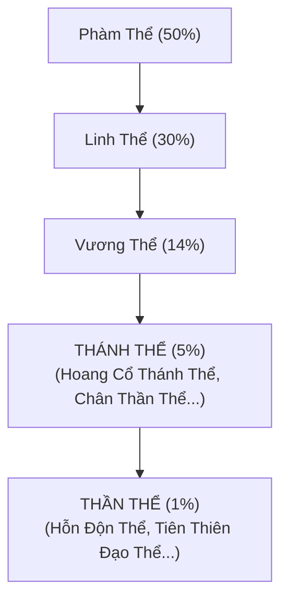

# [01] HỆ THỐNG CẢNH GIỚI, TU VI & THỂ CHẤT

Hệ thống này định hình sức mạnh nền tảng của nhân vật, tốc độ tu luyện tự động và tính năng Tẩy Tủy tìm kiếm các thể chất nghịch thiên.

---

## 1. Cấp Bậc Cảnh Giới (Realms)

Cảnh giới quyết định lượng máu tối đa, lực công kích, phòng thủ và tốc độ hấp thu linh khí:

| Cảnh Giới | Tiểu Cảnh Giới | Tu Vi Yêu Cầu | Tu Vi / Giây | Chỉ Số Thêm (HP/Công/Thủ) |
| :--- | :--- | :--- | :--- | :--- |
| **Luyện Khí** | Tầng 1 $\rightarrow$ Tầng 9 | $100 \rightarrow 1,000$ | $+1 \rightarrow +5$ | $+100 \text{ HP} / +10 \text{ ATK} / +5 \text{ DEF}$ |
| **Trúc Cơ** | Sơ $\rightarrow$ Trung $\rightarrow$ Hậu $\rightarrow$ Viên Mãn | $2,000 \rightarrow 8,000$ | $+10 \rightarrow +25$ | $+500 \text{ HP} / +50 \text{ ATK} / +25 \text{ DEF}$ |
| **Kim Đan** | Sơ $\rightarrow$ Trung $\rightarrow$ Hậu $\rightarrow$ Viên Mãn | $15,000 \rightarrow 50,000$ | $+50 \rightarrow +100$ | $+1,500 \text{ HP} / +150 \text{ ATK} / +80 \text{ DEF}$ |
| **Nguyên Anh**| Sơ $\rightarrow$ Trung $\rightarrow$ Hậu $\rightarrow$ Viên Mãn | $80,000 \rightarrow 250,000$| $+150 \rightarrow +300$| $+4,000 \text{ HP} / +400 \text{ ATK} / +200 \text{ DEF}$|
| **Hóa Thần** | Sơ $\rightarrow$ Trung $\rightarrow$ Hậu $\rightarrow$ Viên Mãn | $400,000 \rightarrow 1M$ | $+400 \rightarrow +800$| $+10,000 \text{ HP} / +1,000 \text{ ATK} / +500 \text{ DEF}$|
| **Luyện Hư** | Sơ $\rightarrow$ Trung $\rightarrow$ Hậu $\rightarrow$ Viên Mãn | $1.5M \rightarrow 5M$ | $+1,200 \rightarrow +2,500$| $+25,000 \text{ HP} / +2,500 \text{ ATK} / +1,200 \text{ DEF}$|
| **Hợp Thể** | Sơ $\rightarrow$ Trung $\rightarrow$ Hậu $\rightarrow$ Viên Mãn | $8M \rightarrow 25M$ | $+3,500 \rightarrow +7,000$| $+60,000 \text{ HP} / +6,000 \text{ ATK} / +3,000 \text{ DEF}$|
| **Đại Thừa** | Sơ $\rightarrow$ Trung $\rightarrow$ Hậu $\rightarrow$ Viên Mãn | $40M \rightarrow 100M$ | $+10,000 \rightarrow +20,000$| $+150,000 \text{ HP} / +15,000 \text{ ATK} / +8,000 \text{ DEF}$|
| **Độ Kiếp** | 9 Trọng Lôi Kiếp | $150M \rightarrow 500M$ | $+30,000 \rightarrow +50,000$| Chuyển biến thành Chân Tiên |

### Cơ Chế Đột Phá
- Khi thanh Tu Vi đạt $100\%$, xuất hiện nút **[Đột Phá Cảnh Giới]**.
- **Tỉ lệ thành công cơ bản**:
  - Luyện Khí $\rightarrow$ Trúc Cơ: $80\%$
  - Trúc Cơ $\rightarrow$ Kim Đan: $65\%$
  - Kim Đan $\rightarrow$ Nguyên Anh: $50\%$
  - Càng lên cao, tỉ lệ càng giảm.
- **Thất bại**: Bị phản phệ, mất $20\%$ tu vi hiện tại.
- **Dùng Đột Phá Đan (Trúc Cơ Đan, Kết Kim Đan...)**: Tăng $+30\%$ đến $100\%$ tỷ lệ thành công.

---

## 2. Hệ Thống Thể Chất & Phẩm Cấp (Physique)

Thể chất là yếu tố quyết định chỉ số đột biến của nhân vật.

### Danh Sách Phẩm Cấp & Tỉ Lệ Tẩy Tủy:

| Phẩm Cấp | Tên Thể Chất Tiêu Biểu | Hiệu Ứng Thuộc Tính | Tỉ Lệ Xuất Hiện |
| :--- | :--- | :--- | :--- |
| **Phàm Thể** | Nhục Thân Phàm Thai, Bì Đao Phàm Thể | Không có buff đặc biệt | $50\%$ |
| **Linh Thể** | Mộc Linh Thể, Hỏa Linh Thể, Kim Cương Thể | $+10\%$ Công kích, $+5\%$ Tu vi/s | $30\%$ |
| **Vương Thể** | Cửu Dương Vương Thể, Băng Phách Vương Thể | $+25\%$ Công kích, $+15\%$ HP, $+10\%$ Bạo | $14\%$ |
| **Thánh Thể** | **Hoang Cổ Thánh Thể**, **Thái Âm Thánh Thể**, **Bất Diệt Thánh Thể**, **Vạn Kiếp Thánh Thể** | $+60\%$ Công kích, $+50\%$ HP, $+30\%$ Thủ, $+20\%$ Tu vi/s | **$5\%$** |
| **Thần Thể** | **Hỗn Độn Thể**, **Tiên Thiên Đạo Thể**, **Chí Tôn Thần Thể** | $+120\%$ Mọi chỉ số, $+50\%$ Bạo kích, Miễn giảm 20% sát thương | **$1\%$** |

---

## 3. Quy Trình Tẩy Tủy (Wash Marrow Flow)

1. Người chơi tiêu hao **10,000 Linh Thạch** cho mỗi lần Tẩy Tủy.
2. Hệ thống gieo xúc xắc ngẫu nhiên xác định phẩm cấp $\rightarrow$ chọn thể chất mới.
3. Giao diện hiển thị:
   - **Thể Chất Cũ**: Thuộc tính hiện tại.
   - **Thể Chất Mới**: Thuộc tính mới vừa quay được.
   - 2 nút bấm: **[Giữ Cũ]** hoặc **[Nhận Mới]**.
4. Nếu người chơi bấm [Giữ Cũ], thể chất cũ được giữ nguyên, phí tẩy tủy không hoàn lại.
5. Hỗ trợ cơ chế tự động (Auto Roll) tương thích với logic script người dùng đã cung cấp (tự dừng khi đạt chữ "Thánh" hoặc "Thần").
