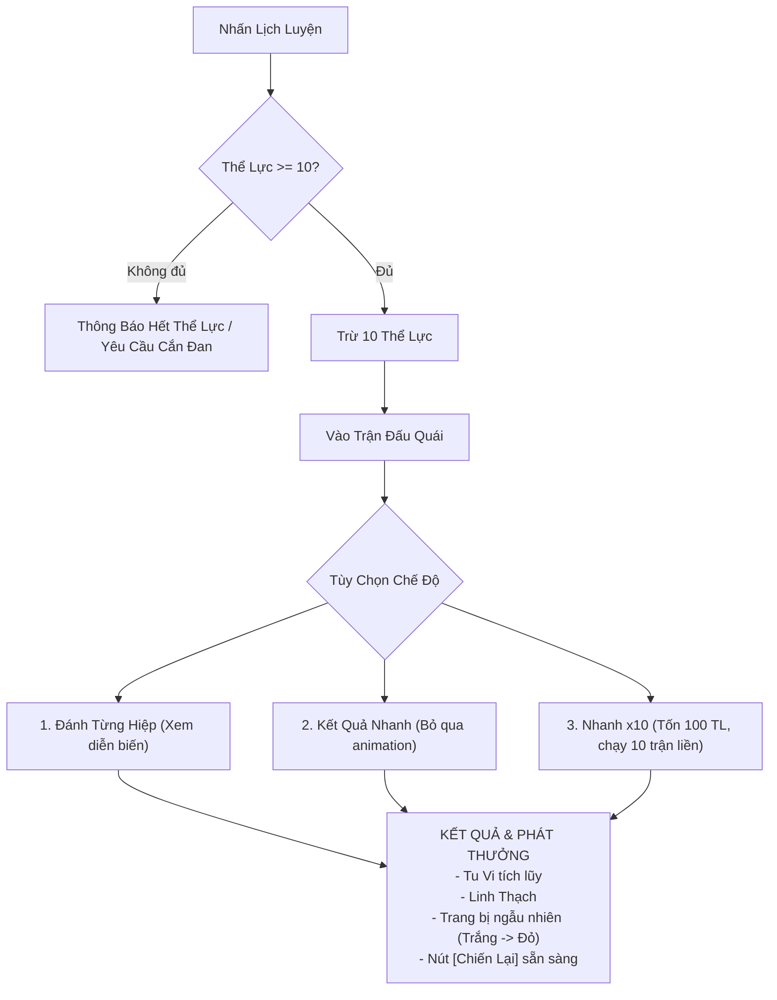

# [03] HỆ THỐNG CHIẾN ĐẤU & LỊCH LUYỆN

Module này định nghĩa công thức tính toán sát thương theo lượt (Turn-based Combat Engine) và chế độ Lịch Luyện cày cấp solo.

---

## 1. Công Thức Chiến Đấu (Combat Engine Formula)

### 1.1 Sát Thương Cơ Bản
$$\text{Damage} = \max\left(1, \left(\text{ATK}_{\text{người đánh}} \times \text{SkillMultiplier}\right) - \left(\text{DEF}_{\text{người nhận}} \times 0.5\right)\right)$$

### 1.2 Khắc Hệ Ngũ Hành (Elemental Counter)
Quy luật tương khắc: **Kim $\rightarrow$ Mộc $\rightarrow$ Thổ $\rightarrow$ Thủy $\rightarrow$ Hỏa $\rightarrow$ Kim**.
- Nếu hệ đánh **khắc** hệ nhận: $\text{Damage} \times 1.25$ ($+25\%$ sát thương).
- Nếu hệ đánh **bị khắc**: $\text{Damage} \times 0.85$ (giảm $15\%$ sát thương).

### 1.3 Bạo Kích & Né Tránh
- **Tỉ lệ Bạo Kích** = $\text{CritChance} - \text{CritResist}$ (Tối thiểu $5\%$, Tối đa $80\%$).
- Khi nổ bạo kích: $\text{Damage} \times 1.5$ (hoặc cao hơn tùy thể chất/trang bị).
- **Thứ tự đánh**: Bên có chỉ số **Tốc Độ (Speed)** cao hơn sẽ được xuất chiêu trước.

---

## 2. Cơ Chế Thể Lực (Stamina Management)

- **Giới hạn Thể Lực**: $100$ điểm (Khởi đầu) $\rightarrow 400$ điểm (theo cảnh giới).
- **Tốc độ hồi phục**: $+1$ Thể Lực mỗi $2 \text{ phút}$ (Idle Regen).
- **Hồi phục nhanh**: Dùng Thể Lực Đan hoặc Rượu Linh từ túi đồ.

---

## 3. Hoạt Động Lịch Luyện (Training & Grinding)

Lịch luyện là hoạt động tiêu hao thể lực chính của người chơi để thu thập trang bị và linh thạch.

### Chế Độ Nhanh x10 (Quick x10)
- Kiểm tra Thể lực tối thiểu phải $\ge 100 \text{ TL}$.
- Tự động chạy ngầm 10 lượt giao tranh độc lập.
- Hiển thị bảng tổng kết gồm tổng Tu Vi, tổng Linh Thạch và danh sách toàn bộ trang bị thu được.

### Cơ Chế Hồi Máu Tự Động Trong Lịch Luyện
- Khi máu nhân vật $< 90\%$: Tự động hiển thị nút **[Hồi Máu]** (dùng dược liệu hoặc đan dược trong túi) để giữ an toàn cho nhân vật trước khi bắt đầu lượt đánh tiếp theo.
