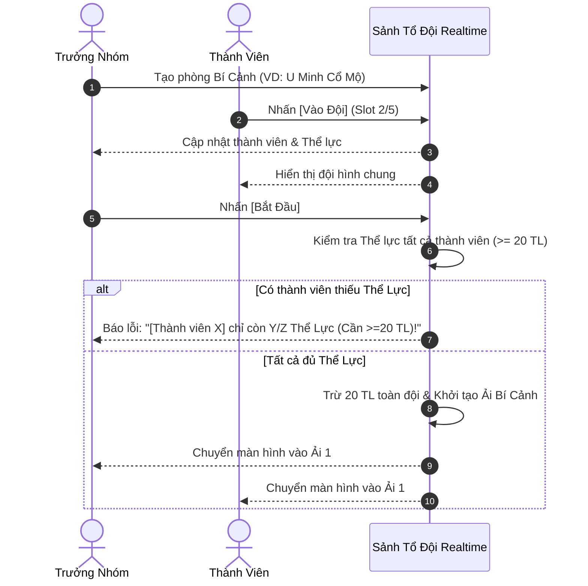

# [04] HỆ THỐNG BÍ CẢNH & TỔ ĐỘI REALTIME

Bí Cảnh là hoạt động co-op chính giữa bạn và nhóm bạn bè, yêu cầu sự phối hợp tổ đội từ 1 đến 5 người chơi thật để cùng vượt qua các ải hiểm trở, lựa chọn Bát Môn và xử lý Kỳ Ngộ.

---

## 1. Cơ Chế Tổ Đội (Party 1 - 5 Players)

### Quy Tắc Kiểm Tra Thể Lực:
- Mỗi lượt đi Bí cảnh tiêu hao **$20 \text{ Thể Lực}$** mỗi thành viên.
- Nếu bất kỳ ai trong đội không đủ $20 \text{ TL}$, nút [Bắt Đầu] sẽ bị chặn và thông báo rõ tên thành viên cần nạp đan thể lực.

---

## 2. Hệ Thống 4 Đại Bí Cảnh Luyện Hư

### 2.1 Kim Cương Thần Điện
- **Cơ chế đặc thù**: Tích lũy **Kim Cương Chi Lực** ($0/3 \text{ Tầng}$).
- **Logic tự động / AI hỗ trợ**:
  - Khi chưa max stack ($<3/3$) và máu cả đội an toàn: Chọn **Option A** (Cưỡng ép phá khóa / Khai thác) để lấy buff stack.
  - Khi đã max stack ($3/3$) hoặc máu có người $<20\%$: Chọn **Option B** (Hấp thu linh tinh / Giữ sức tránh né) để bảo toàn sinh mệnh.

### 2.2 U Minh Cổ Mộ
- **3 Chế độ vượt ải**:
  - **🛡️ An Toàn (Safe)**: Ưu tiên bái tạ, áp chế trận pháp, bỏ qua nguy hiểm.
  - **⚖️ Cân Bằng (Balanced)**: Lựa chọn con đường cân bằng giữa điểm thưởng và an toàn.
  - **☠️ Rủi Ro (Risk)**: Cương ngạnh phá trận, mở quan tài cổ, tế linh hồn $\rightarrow$ Tích tụ oán khí để triệu hồi **Boss Ẩn U Minh**.

### 2.3 Vạn Mộc Linh Cảnh
- **Kỳ ngộ Vườn Linh Nấm**: Lựa chọn hái ngẫu nhiên (Nấm Xanh Thạch, Nấm Thanh Ngọc, Nấm Bạch Vân).
- **Cây Thần Thái Cổ**: Chọn *Nuôi Dưỡng* (An toàn) hoặc *Hái Hạt Giống Thần Mộc* (Rủi ro cao).
- **Linh Thú Kỳ Nhược**: Chọn *Tha Mạng & Chữa Trị* hoặc *Trảm Sát Thu Linh Vật*.

### 2.4 Huyết Ma Uyên
- Ải tàn khốc của ma đạo: Quái vật có khả năng hút máu (Lifesteal), bãi độc huyết sát làm suy giảm ngự thủ toàn đội.

---

## 3. Điều Hướng Bát Môn Độn Giáp

Trong mỗi tầng Bí Cảnh, tổ đội sẽ gặp cánh cổng Bát Môn. Trưởng nhóm hoặc thành viên sẽ chọn cửa để tiến bước:

| Phân Loại Cổng | Tên Cổng Bát Môn | Tác Động / Xác Suất |
| :--- | :--- | :--- |
| **Cát Môn (Cực tốt)** | **Sinh Môn**, **Khai Môn**, **Hưu Môn** | An toàn $100\%$, hồi phục máu, nhận thêm rương báu |
| **Bình Môn (Trung tính)**| **Cảnh Môn**, **Thương Môn** | Gặp quái thú thông thường, độ khó vừa phải |
| **Hung Môn (Rất nguy hiểm)**| **Kinh Môn**, **Tử Môn**, **Đỗ Môn** | Bẫy sát thương, quái tinh anh cực mạnh hoặc đường dẫn vào Boss Ẩn |
