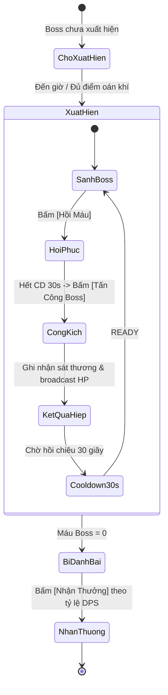

# [05] SĂN BOSS THẾ GIỚI & TƯƠNG TÁC MULTIPLAYER

Module này định nghĩa các tính năng nhiều người chơi cùng lúc (Massive Multiplayer Co-op), tạo không khí sôi động cho nhóm bạn bè cùng cày cuốc.

---

## 1. Săn Boss Thế Giới (World Boss)

World Boss là một thực thể cực mạnh với lượng sinh mệnh khổng lồ mà một người không thể tự đánh bại, đòi hỏi toàn bộ đạo hữu trong server cùng đồng lòng hiệp lực công kích.

### 1.1 Chu Kỳ Hiệp Đấu (Combat Round Cycle)
1. **Bước 1 - Hồi phục**: Người chơi vào Sảnh Boss, bấm **[Hồi Máu]** để hồi đầy đủ sinh lực.
2. **Bước 2 - Công kích**: Bấm **[Tấn Công Boss]** khi đồng hồ đếm ngược hết 30s.
3. **Bước 3 - Broadcast Realtime**: Server trừ máu Boss và gửi socket event `boss:damage_dealt` đến tất cả người chơi. Thanh máu Boss trên màn hình của tất cả bạn bè tụt xuống đồng thời.
4. **Bước 4 - Bảng DPS**: Server tính tổng sát thương của từng người, cập nhật bảng xếp hạng Realtime Top 1, Top 2, Top 3...

### 1.2 Chia Thưởng Theo Đóng Góp (Reward Distribution)
- **Top 1 DPS**: Nhận Rương Vàng Boss + $100,000 \text{ Linh Thạch}$ + Pháp Bảo Bậc Cao.
- **Top 2 - 3 DPS**: Nhận Rương Bạc Boss + $50,000 \text{ Linh Thạch}$.
- **Tất cả người tham gia**: Nhận Linh Thạch và Đan Dược tỷ lệ thuận với lượng máu đã gây ra cho Boss.

---

## 2. Kênh Chat & Sự Kiện Tu Chân Giới (Global Chat & Feeds)

- **Chat Realtime**: Khung chat hiển thị tin nhắn của nhóm bạn kèm theo Cảnh Giới và Thể Chất của người gửi.
- **Thông Báo Thiên Địa (Server Announcements)**:
  - Khi ai đó đột phá đại cảnh giới: *"📢 Chúc mừng đạo hữu **[Hàn Lập]** độ kiếp thành công, bước vào **[Nguyên Anh Kỳ]**!"*
  - Khi ai đó tẩy tủy ra thể chất huyền thoại: *"🌟 Thiên địa dị tượng! Đạo hữu **[Lệ Phi Vũ]** tẩy tủy thức tỉnh **[Hoang Cổ Thánh Thể]**!"*
  - Khi Boss xuất hiện: *"⚔️ Cảnh báo: Yêu Ma Thái Cổ đã thức tỉnh tại Vạn Ma Uyên!"*
