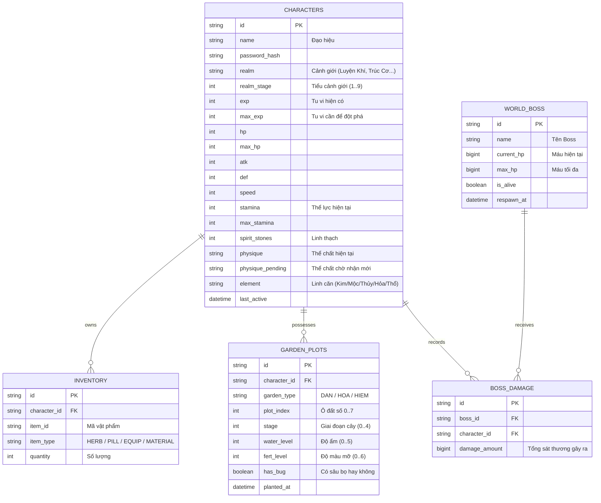

# [06] THIẾT KẾ CSDL (SQLITE) & ĐẶC TẢ GIAO TIẾP API

Tài liệu này định nghĩa cấu trúc dữ liệu bền vững (Persistence Schema) và giao thức kết nối giữa Frontend và Backend.

---

## 1. Cấu Trúc Bảng CSDL (SQLite Tables)

---

## 2. Đặc Tả REST API Endpoints

### 2.1 Xác Thực & Nhân Vật
- `POST /api/auth/login`: Nhập đạo hiệu & mật khẩu $\rightarrow$ Đăng nhập hoặc tự tạo nhân vật nếu là đạo hiệu mới.
- `GET /api/character/me`: Lấy toàn bộ thông tin chỉ số, cảnh giới, tu vi, thể lực của bản thân.

### 2.2 Tu Luyện & Thể Chất
- `POST /api/cultivation/breakthrough`: Thực hiện Đột Phá cảnh giới (trả về kết quả Thành công hay Bị phản phệ).
- `POST /api/physique/wash`: Tiêu hao 10,000 Linh Thạch để Tẩy Tủy $\rightarrow$ Trả về thể chất mới ngẫu nhiên.
- `POST /api/physique/confirm`: Gửi lựa chọn `action: "ACCEPT"` (Nhận mới) hoặc `action: "KEEP"` (Giữ cũ).

### 2.3 Lịch Luyện (Solo Training)
- `POST /api/training/solo`:
  - Body: `{ mode: "NORMAL" | "QUICK_X1" | "QUICK_X10" }`
  - Trừ Thể lực tương ứng, thực thi combat và trả về danh sách phần thưởng (Tu vi, Linh thạch, Trang bị rơi).

### 2.4 Động Phủ & Nông Trại
- `POST /api/farm/well`: Bấm múc nước giếng (trả về Nước Linh Khí và timestamp hồi chiêu giếng).
- `POST /api/farm/action`: Thao tác AOE `{ action: "WATER" | "FERTILIZE" | "CLEAR_BUGS" | "HARVEST", garden: "DAN" | "HOA" | "HIEM" }`.
- `POST /api/alchemy/craft`: Luyện đan dược `{ pill_id: string, quantity: number }`.

---

## 3. Đặc Tả Socket.io Realtime Events

| Tên Event (Client $\rightarrow$ Server) | Tên Event (Server $\rightarrow$ Client) | Ý Nghĩa Chức Năng |
| :--- | :--- | :--- |
| `join_world` | `world_state` | Gửi đạo hiệu khi mở web, nhận danh sách người online |
| `chat:send` | `chat:new_message` | Gửi tin nhắn trò chuyện lên kênh thế giới |
| `party:create` | `party:updated` | Tạo phòng Tổ Đội Bí Cảnh mới |
| `party:join` | `party:updated` | Tham gia vào phòng của bạn bè |
| `party:start` | `party:started` / `party:error` | Trưởng nhóm bắt đầu vượt ải Bí Cảnh |
| `boss:attack` | `boss:hp_updated` | Đánh Boss, cập nhật thanh máu chung cho toàn server |
| `boss:leaderboard` | `boss:dps_ranking` | Cập nhật bảng xếp hạng sát thương của nhóm bạn |
